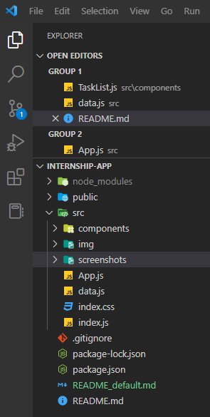
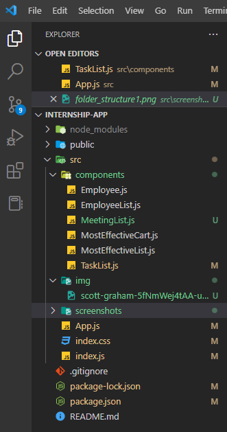

# smartPLAN Manage App - Setup Guide

The application based on the internship assignment was created using the JavaScript library - React.

## Table of contents

- [Overview](#overview)
  - [The setup guide](#the-setup-guide)
  - [The assignment](#the-assignment)
  - [Folder structure](#folder-structure)
  - [Additional functionalities](#additional-functionalities)
  - [Links](#links)
- [Author](#author)

## Overview

### The setup guide

- The application was created using Node.js v18.12.1 and React 18.2.0.
- React Select component was implemented by installing the "react-select" dependency.
- React Font Awesome Icons were integrated by installing the "react-icons" dependency.
- To run the application in the terminal, use `npm start`

### The assignment

Users can perform the following operations:

- Create, read, update and delete an employee
- Create, read, update and delete a task
- View the 5 employees who completed the largest number of tasks in the past month
- Create, read, update and delete a meeting
- View the average point per task

### Folder structure

### Additional functionalities

- **New Entity - Meeting:**

  - Implemented a new entity - meeting.
  - Reason for implementing this entity: Organization of meetings in every company is one of the daily tasks and is more manageable if managers can manipulate using the app.

- **Statistic - Average Point per Task:**
  - Implemented a statistic - average point per task.
  - Reason for implementing this statistic: This provides managers with insight into the difficulty of the tasks.

### Links

- Live Site URL: [Live](https://smart-plan-manage-app-by-react.netlify.app/)

## Author

- Linkedin - [@JelenaTakac](https://www.linkedin.com/in/jelena-taka%C4%8D-b94446220/)
- GitHub - [@JelenaTakac](https://github.com/JelenaTakac)
